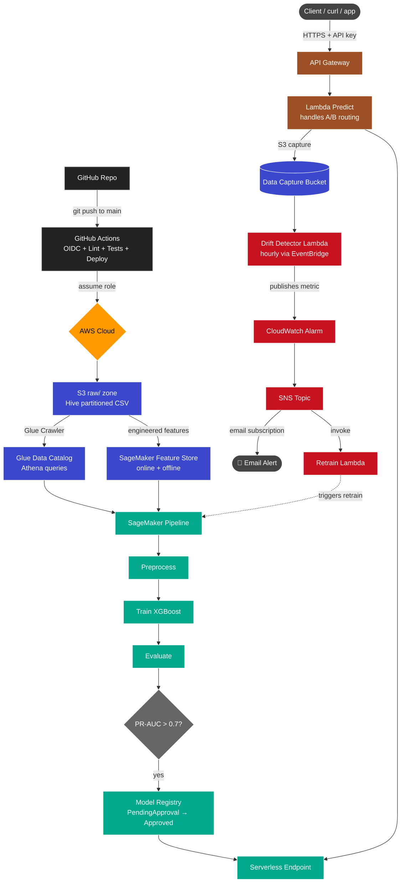

# AWS MLOps Fraud Detection

End-to-end MLOps system on AWS that detects credit card fraud, retrains itself automatically when data drift is detected, deploys via serverless inference behind a public API, and ships every change through GitHub Actions CI/CD.  # noqa: E999


## Architecture



## Tech Stack

- **Cloud**: AWS (S3, Glue, Athena, SageMaker, Lambda, API Gateway, EventBridge, SNS, CloudWatch, IAM)
- **ML**: XGBoost, scikit-learn, pandas
- **MLOps**: SageMaker Pipelines, Feature Store, Model Registry, Custom Drift Detection
- **DevOps**: GitHub Actions (OIDC), Terraform, Python 3.11
- **Region**: ap-south-1 (Mumbai)

## Key Metrics

Trained on the [Kaggle Credit Card Fraud Dataset](https://www.kaggle.com/datasets/mlg-ulb/creditcardfraud) — 284,807 transactions, 0.17% fraud rate.

| Metric | Test Set Value |
|---|---|
| PR-AUC (primary) | ~0.85 |
| ROC-AUC | ~0.97 |
| Fraud detected | high recall + balanced precision |

## Repository Structure

```
.
├── .github/workflows/      # CI + Deploy via GitHub Actions OIDC
├── infra/                  # IAM trust policies, OIDC setup, Terraform skeleton
├── notebooks/              # EDA notebook + findings.md
├── src/
│   ├── data/               # Ingest + feature engineering
│   ├── feature_store/      # Feature Group creation + ingest
│   ├── pipeline/           # SageMaker Pipeline + local fallback + manual register
│   ├── inference/          # Approve, serverless endpoint, Lambda handler, deploy API
│   └── monitoring/         # Drift detector, baseline, alerts, retrain Lambda
├── tests/                  # Pytest smoke tests
├── teardown.sh             # One-command cleanup
└── requirements.txt
```

## Phases Built

- **Phase 0** — Account hardening, IAM, repo skeleton
- **Phase 1** — Data lake (S3 + Glue + Athena) with Hive partitioning
- **Phase 2** — EDA + Feature engineering (Parquet) + SageMaker Feature Store
- **Phase 3** — Training pipeline: SageMaker Pipelines DAG (preprocess → train → evaluate → register)
- **Phase 4** — Model approval + serverless deployment
- **Phase 5** — Public API: Lambda + API Gateway with API key auth
- **Phase 6** — Custom drift detection + alerting + auto-retrain wiring
- **Phase 7** — CI/CD: GitHub Actions OIDC + Terraform skeleton

## Quick Start

```bash
git clone https://github.com/Atharva15965/aws-mlops-fraud-detection.git
cd aws-mlops-fraud-detection
python -m venv .venv && source .venv/bin/activate
pip install -r requirements.txt
cp .env.example .env  # edit with your bucket, region, role ARNs
```

### Test the public API
```bash
curl -X POST 'YOUR_API_URL' \
  -H 'x-api-key: YOUR_API_KEY' \
  -H 'Content-Type: application/json' \
  -d '{"features": [...34 floats...]}'
# → {"fraud_probability": 0.987, "is_fraud": true, "variant": "VariantA", "capture_id": "..."}
```

### Tear down everything
```bash
./teardown.sh
```

## Costs

Designed for AWS Free Tier:
- Serverless Inference: pay per invocation (~$0.0000008/call)
- Lambda + API Gateway: 1M req/month free
- S3 + Glue + Athena: pennies for this dataset
- SageMaker training: 50 free hours/month of `ml.m5.xlarge`

Total cost for a month of light use: under $5.

## Trade offs Worth Noting

- **Serverless Inference** instead of real-time endpoints — keeps idle costs at zero, but limits us to one variant per endpoint. A/B routing happens in the Lambda layer instead.
- **Custom drift detection** instead of SageMaker Model Monitor — Model Monitor's data capture isn't supported on serverless endpoints, so the Lambda writes captures to S3 directly and a scheduled Lambda computes drift scores.
- **Local training fallback** — pending instance quota during build; the SageMaker Pipeline is fully defined and registers v2 automatically once quota approves.

## License

MIT.